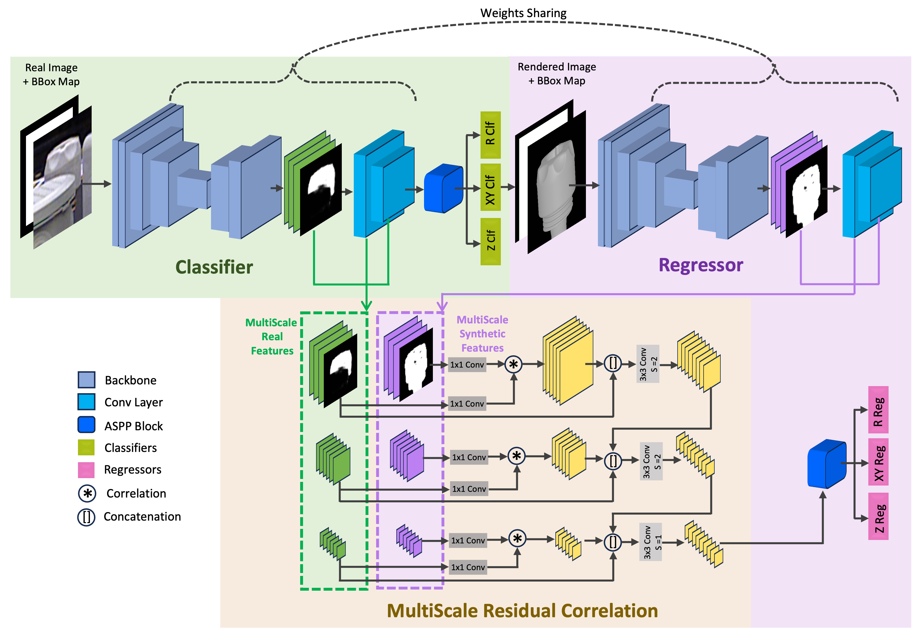

# MRC-Net: 6-DoF Pose Estimation with MultiScale Residual Correlation #

## Description ##
This repo implements [MRC-Net: 6-DoF Pose Estimation with MultiScale Residual Correlation](https://arxiv.org/abs/2403.08019) (CVPR 2024).



MRC-Net is a Siamese two-stage network comprising classification and regression stages. The classification output is used to render an image which guides the regressor. Furthermore, features from real and rendered images are correlated in a multiscale fashion to enhance discriminability.

Features:
- *Performance*: MRC-Net achieves state-of-the art AR scores. Details are listed in Table 2 and 3 in the paper.
- *Speed*: MRC-Net runs at near real-time (including the rendering time).
- *Simplicity*: MRC-Net is an end-to-end framework without the need for pre-initialization, post-processing and iterative refinement. We provide a streamlined implementation for easier follow-ups.

## Setup ##
Run the following commands (only needed for once). Comment out sections when necessary if the stuffs are already there.
```
source scripts/install_deps.sh  # Create an environment 'mcrnet' and install dependencies
bash scripts/prepare_data.sh  # download all datasets needed and generate caches
```

## Training ##
Following is an example script when training on a single machine (node) with 8 GPUs:
```
bash scripts/run_training.sh
```

## Inference ##
Our pretrained model weights can be downloaded from [this link](https://drive.google.com/file/d/1Bz2ZFAoTHk-pjCcr3HceCLIcj0ugYYia/view?usp=sharing).

Put the weights under `chkpt_<dataset>` and then run the inference script. For example, if you want to run inference for TLESS dataset, then put `tless.pth` under `chkpt_tless` and run the following command:

```
bash scripts/run_inference.sh
```
Modify variables `DATASET` and `SUFFIX` when necessary.

## Citation ##
If you find our work helpful, please cite our works:
```
@inproceedings{li2024mrcnet,
  title={MRC-Net: 6-DoF Pose Estimation with MultiScale Residual Correlation},
  author={Li, Yuelong and Mao, Yafei and Bala, Raja and Hadap, Sunil},
  booktitle={2024 IEEE Conference on Computer Vision and Pattern Recognition (CVPR)},
  year={2024},
  organization={IEEE}
}
```

## Acknowledgement ##
Part of the code is based on [SC6D](https://github.com/dingdingcai/SC6D-pose). Thanks the authors for their contributions!
